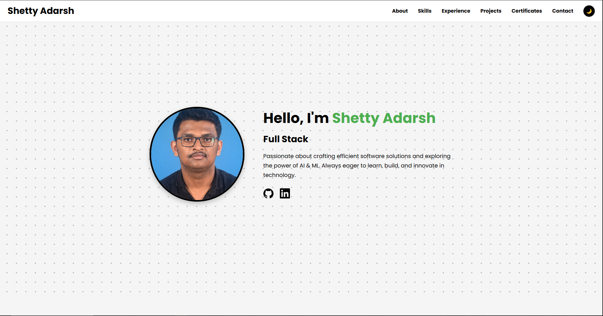

# 🌐 Personal Portfolio Website

This is my **personal portfolio website**, built to showcase my projects, skills, and experience as a developer.  
It is live at: **[adarsh-2512.github.io/portfolio](https://adarsh-2512.github.io/portfolio/)** 🚀

---

## 📖 About the Project
The website is designed as a clean and modern portfolio to highlight:
- 👨‍💻 About Me section
- 🛠 Skills & Tech Stack
- 📂 Projects
- 📞 Contact information

The goal is to create a **lightweight, fast, and responsive portfolio** that can be easily hosted using **GitHub Pages**.

---

## 🛠️ Tech Stack
- **HTML5** – Structure of the website  
- **CSS3** – Styling with custom variables (light/dark themes)  
- **JavaScript (ES6)** – Interactivity and dynamic UI  
- **Git & GitHub Pages** – Version control and hosting  

---

## ⚡ Features
- 🎨 **Responsive design** – Works on all devices  
- 🌗 **Light & Dark mode support** (default is light mode)  
- 📸 **Project showcase with images**  
- 🖼️ **Custom favicon**  
- 🚀 **Deployed using GitHub Pages**  

---

---

## 🚀 Deployment
The website is hosted with **GitHub Pages**:
1. Push your code to the `main` branch.  
2. Go to **Repo Settings → Pages → Deploy from branch**.  
3. Select `main` branch → `/root`.  
4. Your site will be live at: `https://username.github.io/repo-name/`.

---

## 📌 How I Built It
1. Started with a simple **HTML & CSS** layout.  
2. Added **CSS variables** for light and dark themes.  
3. Used **JavaScript** to handle dynamic interactions.  
4. Integrated a **custom favicon** for branding.  
5. Deployed via **GitHub Pages** for free hosting.  

---

## 📬 Contact
If you'd like to connect or collaborate, feel free to reach out:
- 📧 Email: adarshsubhashshetty937.com  
- 💼 LinkedIn: [Your LinkedIn](https://www.linkedin.com/in/shetty-adarsh-156480285/)  
- 🐙 GitHub: [adarsh-2512](https://github.com/adarsh-2512)

---
✨ Built with passion and deployed using GitHub Pages.
